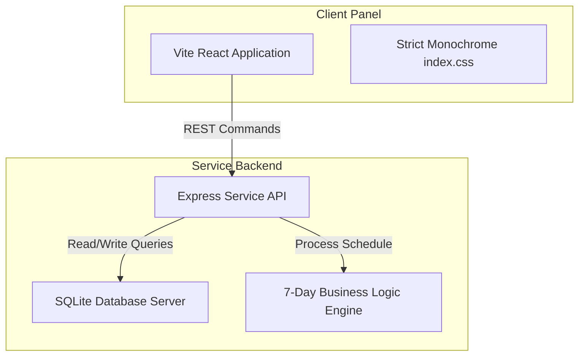

# Manivtha Tours & Travels - Customer Occasion-Based Booking Reminder System

An enterprise-grade, high-end SaaS CRM platform custom-built for **Manivtha Tours & Travels, Hyderabad**. The system stores client occasion preferences (Birthdays, Wedding Anniversaries, and Festivals) along with travel requirements and logs, automatically calculating milestones 7 days in advance to send booking drafts and capture repeat reservations.

Designed with a strict, luxurious **black-and-white (monochrome) theme** following the aesthetics of top-tier developer platforms (such as Linear and Vercel). No emojis, bright colors, cartoon layouts, or glassmorphism are utilized.

---

## Technical Architecture



### Stack & Tools
- **Frontend Framework**: React (Vite-based)
- **Styling**: Strict Black & White Vanilla CSS layout system
- **Backend Framework**: Node.js Express Server
- **Database Engine**: SQLite (relational database with migrations and seeds)
- **Operations Date Context**: Configured as **June 11, 2026** (Simulated System Reference Date)

---

## Core System Features

1. **Staff Split-Screen Sign In**:
   - Split layout sign-in console with corporate welcome section on the left and input fields on the right.
   - Demo credentials: Username `admin` / Password `manivtha2026`.

2. **Executive Milestone Dashboard**:
   - 4 KPI monochrome metric panels (Total Customers, Reminder Rules, Active Monitoring, Pending Alerts).
   - Dynamic sorting, search filters, and status select update panels (Active, Completed, Archived).

3. **Multi-Section Form Console**:
   - Inline customer registration modal.
   - Form inputs for occasion types, occasion date calendar, monitoring statuses, and travel specification logs.

4. **Alerts & Redirections**:
   - Scans active occasions 7 days in advance.
   - Categorizes alerts as:
     - `CRITICAL ACTION` (<= 2 days)
     - `SCHEDULED WARNING` (<= 7 days)
   - Dynamic, customizable WhatsApp redirect link integration.

5. **Reports & SVG Analytics**:
   - Monochrome line charts visualizing occasion frequency curves by month.
   - Percentage progress bars showing CRM status ratios.

6. **Administrative Configurations**:
   - Settings window to change alert trigger thresholds (days prior), default WhatsApp templates, mock SMTP host endpoints, and staff access rights.

---

## Database Schema Model

The sqlite schema consists of three relational tables:

```sql
-- Customers Profile
CREATE TABLE IF NOT EXISTS customers (
    id INTEGER PRIMARY KEY AUTOINCREMENT,
    name TEXT NOT NULL,
    email TEXT UNIQUE NOT NULL,
    phone TEXT NOT NULL,
    created_at TIMESTAMP DEFAULT CURRENT_TIMESTAMP
);

-- Occasion Preferences Rules
CREATE TABLE IF NOT EXISTS customer_occasionbased_booking_remi (
    id INTEGER PRIMARY KEY AUTOINCREMENT,
    customer_id INTEGER NOT NULL,
    occasion_type TEXT CHECK(occasion_type IN ('birthday', 'anniversary', 'festival')) NOT NULL,
    occasion_date TEXT NOT NULL,
    reminder_date TEXT NOT NULL,
    festival_name TEXT,
    status TEXT CHECK(status IN ('Active', 'Completed', 'Archived')) DEFAULT 'Active',
    notes TEXT,
    created_at TIMESTAMP DEFAULT CURRENT_TIMESTAMP,
    updated_at TIMESTAMP DEFAULT CURRENT_TIMESTAMP,
    FOREIGN KEY(customer_id) REFERENCES customers(id)
);

-- Triggered CRM Alerts
CREATE TABLE IF NOT EXISTS alerts (
    id INTEGER PRIMARY KEY AUTOINCREMENT,
    reminder_id INTEGER NOT NULL,
    alert_date TEXT NOT NULL,
    status TEXT CHECK(status IN ('Active', 'Dismissed')) DEFAULT 'Active',
    urgency TEXT CHECK(urgency IN ('Red', 'Amber')) NOT NULL,
    created_at TIMESTAMP DEFAULT CURRENT_TIMESTAMP,
    FOREIGN KEY(reminder_id) REFERENCES customer_occasionbased_booking_remi(id)
);
```

---

## Setup & Running Locally

### Prerequisites
Ensure you have **Node.js** (v18+) and **npm** installed on your system.

### Running the Backend Server
1. Navigate to `/backend`:
   ```bash
   cd backend
   ```
2. Install dependencies:
   ```bash
   npm install
   ```
3. Initialize the database and run seeds:
   ```bash
   npm run seed
   ```
4. Start the server (runs on port 5000):
   ```bash
   npm start
   ```

### Running the Frontend Server
1. Navigate to `/frontend`:
   ```bash
   cd ../frontend
   ```
2. Install dependencies:
   ```bash
   npm install
   ```
3. Launch development dev server (runs on port 5173):
   ```bash
   npm run dev
   ```

### Running Automated Integration Tests
Verify API endpoints, date normalization rules, and alert dismissals:
```bash
cd ../tests
node api_tests.js
```
All 31 integration test points should pass successfully.
